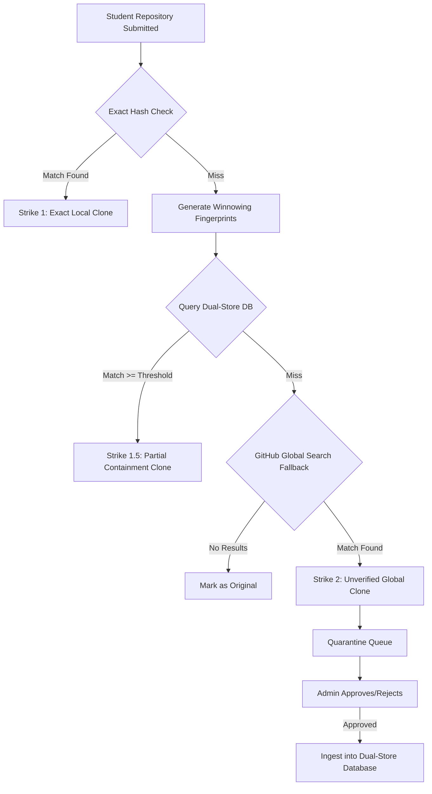

# GitPulse Forensic Engine: Architecture & Algorithm Workflow

This document explains the mathematical and architectural pipeline powering GitPulse's plagiarism and clone detection engine. At its core, the system relies on **Tree-Sitter AST (Abstract Syntax Tree) Parsing**, **Selective Normalization**, and **Positional Winnowing** to create an immutable structural fingerprint of code.

## 1. The Core Problem
Relying on exact string matching is flawed. A student can bypass detection by simply:
- Renaming variables (`studentMarks` -> `x`)
- Adding meaningless comments
- Injecting dead code (`console.log('here')`)
- Reordering non-dependent logic blocks

To solve this, GitPulse ignores the raw text and analyzes the *underlying grammar structure* of the code.

---

## 2. The Positional Winnowing Algorithm

The engine processes files in 5 distinct steps to generate a highly compressed, noise-resistant fingerprint array.

### Step 1: AST Parsing
We use Tree-Sitter to generate an Abstract Syntax Tree of the source code. This gives us a raw, hierarchical tree of the code's grammatical structure.

### Step 2: Selective Normalization
We traverse the AST and flatten it into a sequence. To prevent renaming and basic obfuscation attacks, we selectively normalize nodes:
- **Identifiers** (`x`, `userData`) -> `VAR`
- **Literals** (`123`, `"hello"`) -> `NUM`, `STR`, `BOOL`
- **Operators** (`+`, `==`) -> `PLUS`, `EQ`
- **Blocks/Control** (`if_statement`, `while_statement`) -> Preserved
- **Comments/Punctuation** -> Dropped entirely

**Example Transformation:**
*Original Code:*
```javascript
let total = price + 50;
```
*AST Sequence:*
```text
lexical_declaration:VAR:ASSIGN:VAR:PLUS:NUM
```

### Step 3: K-Grams (Overlapping Chunks)
We group the normalized sequence into overlapping chunks of size `K` (the Noise Threshold). 
If `K = 15`, we take 15 consecutive nodes, convert them to a string, and hash them using a fast 32-bit integer hash (djb2). This results in an array of integers representing structural "sentences."

### Step 4: The Winnowing Window (Fuzzy Selection)
To make the algorithm resistant to code injection (e.g., adding a random `console.log`), we apply a Sliding Window of size `W`.
Within every window of `W` hashes, we select the **minimum hash value**. 

*Why?* If a student injects noise into the middle of a stolen file, the local hashes around the injection change. However, because we slide a window and pick the minimum, the algorithm simply slides over the noise and continues selecting the exact same minimum hashes from the stolen structure.

### Step 5: Positional Extraction
As we select the winning minimum hashes, we preserve their byte-level coordinates (`startPos`, `endPos`). 

**Final Output Payload:**
```json
[
  { "hash": 847291, "startPos": 120, "endPos": 450 },
  { "hash": 102938, "startPos": 455, "endPos": 920 }
]
```

---

## 3. The Dual-Store Database Architecture

To store these fingerprints efficiently across thousands of repositories, we use a custom JSON Dual-Store.

### Inverted Index (`.fingerprint_index.json`)
Used strictly for $O(1)$ candidate retrieval. It maps a single hash to an array of Document IDs.
```json
{
  "847291": ["doc_uuid_1", "doc_uuid_2"]
}
```

### Document Store (`.fingerprint_docs.json`)
Holds the heavyweight metadata and the exact positional evidence array for reporting.
```json
{
  "doc_uuid_1": {
    "sourceUrl": "https://github.com/...",
    "fileName": "utils.js",
    "fingerprints": [ { "hash": 847291, "startPos": 120, "endPos": 450 } ]
  }
}
```

---

## 4. The Complete Ingestion & Detection Workflow

When a repository is analyzed, the pipeline executes the following sequence:



### Containment Scoring
If a match is found in the Dual-Store, we do not calculate standard similarity (Jaccard). We calculate **Containment**.
If the student generated 100 fingerprints, and 45 of them exist in `doc_uuid_1`, their Containment Score is **45%**. This mathematically proves that 45% of their file's logic was lifted from that specific source, regardless of how large the original source file is.
