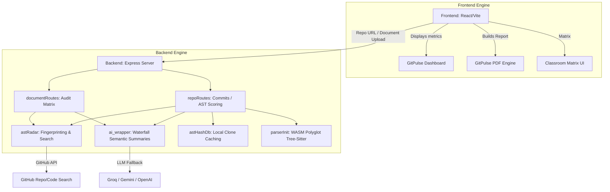

# GitPulse MVP (Project-Verified)

Welcome to the **GitPulse MVP (Project-Verified)** repository. This application is a dual-engine forensic analysis tool designed specifically for educators, reviewers, and code auditors to algorithmically and semantically verify code authenticity. 

It fuses **WASM Tree-Sitter Mathematics (AST)** with **LLM Semantic Intelligence** to detect high-velocity code dumps, plagiarized tutorials, direct clones, and hallucinated document claims.

---

## 🏛 System Architecture
The application runs on a decoupled React Frontend and an Express/Node.js Algorithmic Backend Engine.



---

## 💻 Frontend: Code Visualization

The client is built on **React 19, Vite, Recharts, and Tailwind CSS**. It acts as the visual translation layer for complex algorithms.

### 1. `GitPulseDashboard.jsx` (The Core UI)
- **Functionality**: The central nervous system of the client. It handles the main search input, kicks off the backend API calls (`/api/link-repo`), and orchestrates the rendering of incoming data.
- **Visuals**: Plots structural Edit Distances on an area chart (`Evolution Pulse`), groups commits into standard vs. suspicious categories (`Semantic Clusters`), and renders the `LLM Intelligence` readout.

### 2. `GitPulsePdfReport.jsx` (The Exporter)
- **Functionality**: Acts as a forensic immutable record generator. 
- **Under the Hood**: Uses `html2pdf.js` to invisibly render a perfectly styled duplicate of the dashboard data (including the Document Alignment Matrix) into a hidden DOM element, snapshots it, and triggers a raw PDF download. 

### 3. `ClassroomMatrix.jsx` (The Auditor UI)
- **Functionality**: A specific user interface that allows an auditor to upload a student's technical report (`.docx`), pinging the backend's `/api/audit-document` route. It displays a side-by-side verification table that proves or disproves if technologies claimed in writing actually exist in the compiled repository.

---

## ⚙️ Backend: Algorithmic Core

The backend is built in **Express & Node.js**, serving as the heavy-lifting computational core. It intercepts requests and triggers independent intelligence modules. 

### Core Routing logic
#### `/api/link-repo` (`server/routes/repoRoutes.js`)
- Iterates through the top 30 commits of a repo.
- For each commit, it downloads the GitHub diff, splits the hunk into `oldCode` and `newCode`, and feeds them to WASM **Tree-Sitter**.
- **Zhang-Shasha Distance Proxy**: Calculates exactly how many semantic AST nodes were added/removed between the old and new tree. 
- Math converts this into an **Integrity Score**. A low score means humanly-impossible mass code injection. 
- It then queues the Originality module (`huntGlobalClones`) and the LLM module (`generateLLMSummary`).

#### `/api/audit-document` (`server/routes/documentRoutes.js`)
- Takes an uploaded `.docx` file using `multer` and extracts raw strings using `mammoth.js`.
- Uses regular expressions to fuzzily slice a window around "Technologies Used" or "Tech Stack" headers.
- Feeds the slice to the LLM to yield normalized JSON arrays of claims. 
- Kicks the array into `astRadar.js` to mathematically prove authenticity. 

### Utility Tooling

#### `astRadar.js` (The Global Intelligence Tool)
- `extractProjectFingerprint()`: The core heuristic. Recursively scans the GitHub tree. Aggressively blacklists minified builds, `node_modules`, and bundles >150KB. It parses the top 5 largest remaining files via Regex Cyclomatic Complexity to find the "heaviest logic file". It grabs a 50-character string from the center of this file.
- `huntGlobalClones()`: Submits the 50-char Anchor String to global GitHub Code Search. If matches are found, it detects tutorial boilerplate or massive outright clones. 
- `generateStructuralHash()`: Strips all variable names and strings from a Tree-Sitter AST map, creating a rename-proof, syntax-only hash for clone caching. 
- `verifyTechStack()`: Cleanses and strips hyphens/spaces to super-normalize `package.json` strings and LLM claims. Fuzzy-matches claims to ensure a student isn't lying on their report. 

#### `ai_wrapper.js` (The Semantic LLM Bridge)
- `analyzeRepositoryAST()`: Bridges the pure maths of the WASM algorithms with readable semantic summaries. Implements the **LLM Waterfall**:
  1. **Groq (Primary)**: Uses `llama-3.1-8b-instant` for ultra-fast, cheap processing.
  2. **Google GenAI (Secondary)**: Fails over to `gemini-1.5-flash-preview` on rate-limits.
  3. **OpenAI (Fallback)**: Drops to `gpt-4o-mini` if all else fails.

#### `astHashDb.js` 
- A fully synchronous zero-cost local database mechanism. Caches a `generateStructuralHash` to `db.json` when a known-clone is found on GitHub. On subsequent scans of other students, if the AST hash matches, it flags them at **Strike 1** without making a single external API request.

#### `parserInit.js`
- Spawns the WebAssembly polyglot Tree-Sitter bindings, mapping extensions (e.g., `.jsx`) directly to compiled `tree-sitter-javascript.wasm` binaries at server boot.

---

## 🚀 Getting Started

To run the application locally, you need to spin up both engines. 

> [!IMPORTANT]
> Ensure you have an `.env` file loaded into your `server` directory with `GITHUB_TOKEN`, `GROQ_API_KEY`, `GEMINI_API_KEY`, and `OPENAI_API_KEY` defined. 

**Terminal 1: The Backend Engine**
```bash
cd server
npm install
npm run dev
# Running on http://localhost:5000
```

**Terminal 2: The Frontend UI**
```bash
# In the root repository directory
npm install
npm run dev
# Running on http://localhost:5173
```