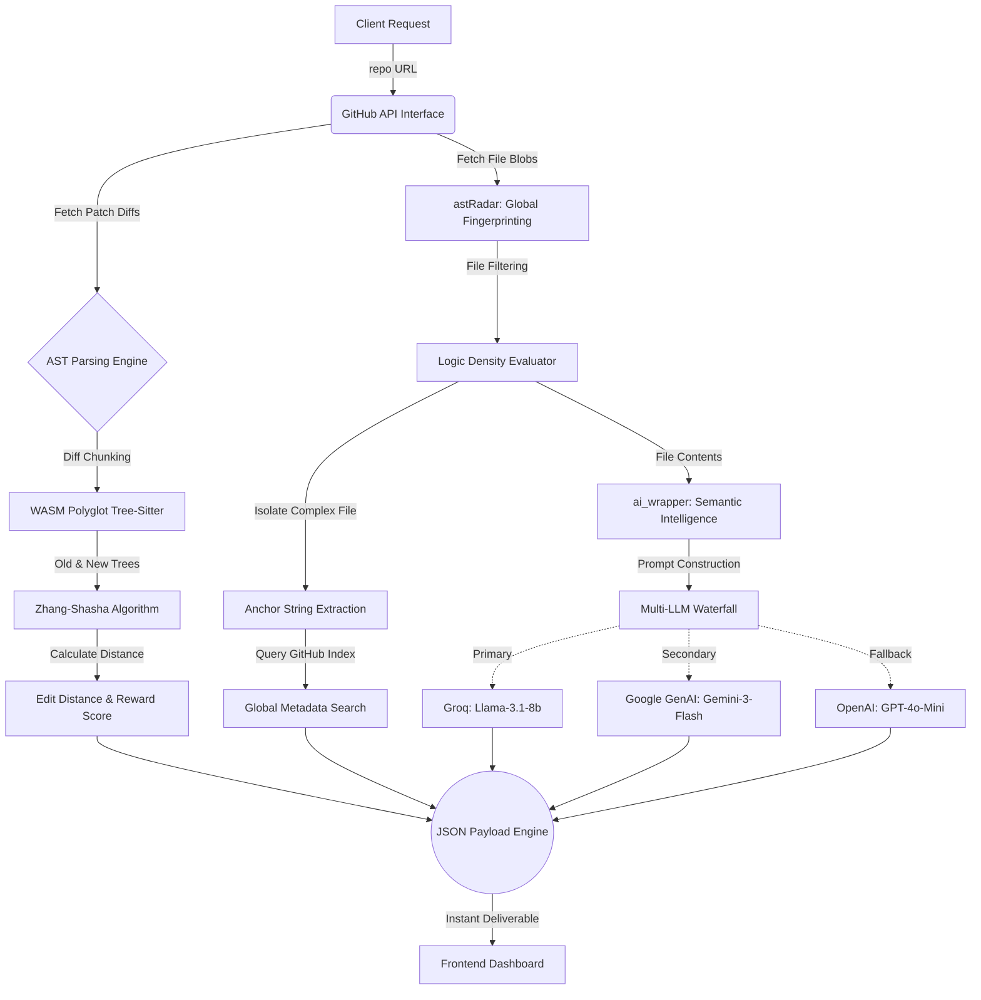

# Project-Verified: Algorithmic Server Engine

Welcome to the backend engine for **Project-Verified**. This Node.js server acts as the heavy-lifting computational core of the project. It handles raw codebase scraping, structural AST (Abstract Syntax Tree) generation, algorithm-based code distancing, and integrates with multiple LLMs to semantically verify human code authorship.

Student submits repo
        │
        ▼
Parse AST (already done for scoring)
        │
        ▼
generateStructuralHash(tree.rootNode)
        │
        ▼
┌───────────────────────────────┐
│  astHashDb.lookup(hash)       │
│  (local JSON file, ~5ms)      │
└───────────────────────────────┘
     Hit? ──YES──► Flag: "Local Clone Detected"  (cost: $0)
        │
        NO
        │
        ▼
huntGlobalClones (GitHub Search API)
        │
     Hit? ──YES──► Download matched file
                        │
                        ▼
                   Parse matched file AST
                        │
                        ▼
                   astHashDb.save(hash, url)  ◄── "The Genius Move"
                        │
                        ▼
                   Flag: "Direct Clone Detected"
        │
        NO
        │
        ▼
Flag: "Original"

## 🏗️ Complete Architecture Diagram

## 🧠 Deep Dive: The Scoring Metrics & Reward System

### 1. Tree Edit Distance & The Reward Score
Simple line-of-code additions are notoriously flawed metrics. Instead, the engine utilizes **WebAssembly Tree-Sitter** to generate an Abstract Syntax Tree (a pure mathematical representation of logic) for the code file **before** the commit, and **after** the commit. 

It then applies an algorithmic proxy for the **Zhang-Shasha Algorithm** to calculate `d` (Edit Distance)—the number of semantic operations required to transform the old tree into the new tree.

**The Integrity Score Formula:**
`r = 1 - (Edit Distance / Total New Nodes)`

This score essentially measures how much of the new code is genuinely integrated via careful, human keystrokes versus artificially mass-injected.

**The Threshold Conditions:**
- 🟢 **Authentic (Score: 0.85 - 1.00):** "Steady Refactoring". Indicates slow, methodical, human-paced development. Often involves precise modifications to control flows and variable names.
- 🔵 **Standard (Score: 0.45 - 0.84):** "Active Development". Represents normal feature additions, module imports, and chunk-logic implementations.
- 🔴 **Suspect (Score < 0.45):** "High-Velocity Dumps". Flagged as completely anomalous. Represents massive structural mutations with zero transitional editing. Usually signifies bulk pasting of AI-generated content or completely uncredited boilerplate templates.

---

## 🌍 Deep Dive: Global Fingerprinting & Clone Detection

The `astRadar.js` module aggressively proves whether a codebase relies on uncredited external sources. 

### The Fingerprint Extraction Process:
1. **File Tree Filtering:** The algorithm recursively queries the GitHub repository tree. It strips away meaningless configuration (`node_modules`, configs, tests) and drops files under 200 bytes.
2. **Logic Density Scoring:** It downloads the raw code of the top 5 largest files and runs an intelligent Regex evaluator to count control flows and statements (`function`, `=>`, `if`, `while`, `catch`). The file with the highest syntax count is crowned the "Most Complex Logic File."
3. **Anchor String Isolation:** Taking the heaviest file, it skips imports, brackets, and comments, mapping directly to the mathematical center of the logic code to extract a specific 50-character immutable "Anchor String."

### The Search & Evaluation Conditions:
The engine strategically throttles and searches the global GitHub index for the exact Anchor String.
- **🟢 `Original`:** `0 Matches`. The anchor string logic does not exist natively anywhere else globally. The code signature is entirely unique.
- **🔴 `Tutorial Boilerplate`:** `> 30 Matches`. The specific string was found across dozens of repos. This explicitly proves the developer copy-pasted a public tutorial, generic framework template, or massive AI boilerplate without custom logic alteration.
- **🟡 `Direct Clone Detected`:** `1 - 29 Matches`. A highly suspicious, direct identical match found in a few specific repositories. It returns the exact URLs for immediate forensic review.

---

## 🤖 Deep Dive: AI Summarization & Semantic Verification

While the algorithms handle the mathematical distance, the `ai_wrapper.js` module translates the raw CST (Concrete Syntax Tree) and logic into detailed human-readable context.

### Semantic Review:
The heaviest fingerprint file logic and its AST fragment are merged into a dense technical prompt. The LLM is forced to act as an expert code analyzer, tasked with pulling out the `overall_logic`, tracking `key_patterns` utilized, and making an educated guess as to the `likely_source` (e.g., student-written, copied from ChatGPT, tutorial-based).

### Waterfall Generation Stability:
To guarantee rapid and consistent analysis without downtime, the engine executes queries through an intelligent, self-healing cascading provider waterfall:
- ⚡ **Primary (Groq SDK):** Evaluates the code using `llama-3.1-8b-instant` for blazing-fast edge-compute evaluation.
- 🔄 **Secondary (Google GenAI):** If Groq gets rate-limited, the wrapper instantly fails-over to `gemini-3-flash-preview` to leverage massive coding context windows.
- 🛡️ **Tertiary (OpenAI):** As an absolute final safety net, it routes to `gpt-4o-mini`.

This robust multi-modal architecture ensures that the semantic forensics are generated cleanly, returning an intelligence payload that perfectly complements the brutal mathematical constraints of the Integrity Score.
